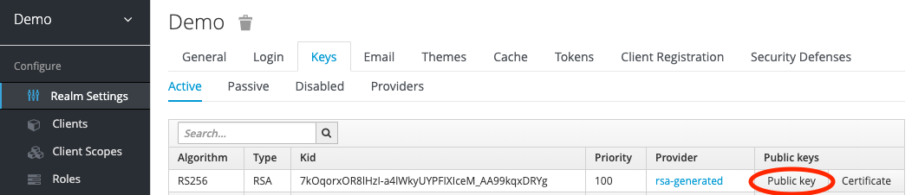

.. _configuration:

Configuration
=============

Twitcher has a configuration file `development.ini` for local development.
Copy and edit this configuration to adapt to your settings.

Service
-------

Edit the configuration to change the service parameters.

The URL of the Twitcher service endpoint:

.. code-block:: ini

  twitcher.url = http://localhost:8000

Basic Authentication
--------------------

Twitcher uses basic authentication for client application registration and service registration.
Edit username and password in the configuration:

.. code-block:: ini

  twitcher.username = demo
  twitcher.password = demo

OAuth2 Token Generator
----------------------

Twitcher uses `OAuth2 tokens`_ to control OWS service access.
You can use several types of tokens.

Random Token
++++++++++++

Tokens with UUID strings stored in the local twitcher database.

Edit the configuration file:

.. code-block:: ini

  twitcher.token.type = random_token

Signed Token
++++++++++++

`JWT tokens`_ signed with a certificate. You can generate a self-signed certificate
for testing with the Makefile:

.. code-block:: console

  $ make gencert

Edit the configuration file:

.. code-block:: ini

  twitcher.token.type = signed_token
  twitcher.token.keyfile = key.pem # private key
  twitcher.token.certfile = pubkey.pem # public key

Custom Token
++++++++++++

JWT tokens using a shared secret. You can generate a UUID secret with:

.. code-block:: console

  $ make gensecret

Edit the configuration file:

.. code-block:: ini

  twitcher.token.type = custom_token
  twitcher.token.secret = secret

Keycloak Token
++++++++++++++

JWT tokens generated by a Keycloak_ OAuth2 service.

Edit the configuration file:

.. code-block:: ini

  twitcher.token.type = keycloak_token

You need to copy the public key of your Keycloak realm to the configuration (see screenshot):

.. code-block:: ini

  keycloak.token.secret = secret

.. _OAuth2 tokens: https://oauthlib.readthedocs.io/en/latest/oauth2/tokens/bearer.html
.. _JWT tokens: https://pyjwt.readthedocs.io/en/latest/usage.html
.. _Keycloak: https://www.keycloak.org/
