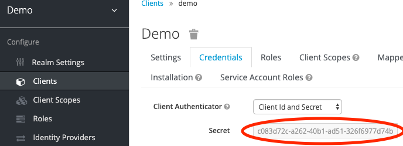

.. _tutorial:

********
Tutorial
********

.. contents::
    :local:
    :depth: 2

Using the OWSProxy with a WPS application
=========================================

The ``OWSProxy`` is a proxy service for OWS services.

First you need an external WPS. You can use `Emu WPS service <http://emu.readthedocs.io/en/latest/>`_ from Birdhouse.
Get it from GitHub and run the installation:

.. code-block:: console

    $ git clone https://github.com/bird-house/emu.git
    $ cd emu
    $ make install
    $ make start

The Emu WPS service is available by default at the URL:
http://localhost:5000/wps?service=WPS&version=1.0.0&request=GetCapabilities

Make sure Twitcher is installed and running:

.. code-block:: console

   $ cd ../twitcher  # cd into the twitcher installation folder
   $ pserve development.ini

Prepare your Client Application
-------------------------------

Register your client application at twitcher to get
a *client_id* and *client_secret*:

.. code-block:: console

  $ twitcherctl -k --username demo --password demo add --name demo_app
  {'name': 'demo_app', 'client_id': 'id', 'client_secret': 'secret'}

Get an access token to use the registration service using your
OAuth *client_id* and *client_secret* with scope *register*:

.. code-block:: console

  $ twitcherctl -k gentoken -i client_id -s client_secret --scope register
  {'access_token': 'TOKEN', 'expires_in': 3600, 'scope': ['register'], 'token_type': 'Bearer'}

Register a WPS service
----------------------

Register the Emu WPS service at the Twitcher ``OWSProxy``:

.. code-block:: console

   $ twitcherctl -k --username demo --password demo register --name emu http://localhost:5000/wps

If you don't provide a name with ``--name`` option then a nice name will be generated, for example ``sleepy_flamingo``.

Use the ``list`` command to see which WPS services are registered with OWSProxy:

.. code-block:: console

   $ twitcherctl -k --username demo --password demo list
   [{'url': 'http://localhost:5000/wps', 'type': 'wps', 'name': 'emu', 'auth': 'token'}]

Access a registered service
---------------------------

By default the registered service is available at the URL ``https://localhost:8000/ows/proxy/{service_name}``.
Replace the ``service_name`` with the registered name.

Run a ``GetCapabilities`` request for the registered Emu WPS service:

.. code-block:: console

    $ curl -k "http://localhost:8000/ows/proxy/emu?service=WPS&request=GetCapabilities"

Run a ``DescribeProcess`` request:

.. code-block:: console

    $ curl -k "http://localhost:8000/ows/proxy/emu?service=WPS&version=1.0.0&request=DescribeProcess&identifier=hello"

Use a token to run an execute request
-------------------------------------

By default the WPS service is protected by the ``OWSSecurity`` wsgi middleware.
You need to provide an OAuth access token to run an execute request.

Run an ``Exceute`` request:

.. code-block:: console

    $ curl -k "http://localhost:8000/ows/proxy/emu?service=WPS&version=1.0.0&request=Execute&identifier=hello&DataInputs=name=tux"

Now you should get an XML error response with a message that you need to provide an access token.

We need to generate an access token with ``twitcherctl`` using OAuth *client_id* and *client_secret*
with scope *compute*:

.. code-block:: console

    $ twitcherctl -k gentoken -i client_id -s client_secret --scope compute
    {'access_token': 'TOKEN', 'expires_in': 3600, 'scope': ['compute'], 'token_type': 'Bearer'}

By default the token has a limited life time of one hour.

For testing you can provide the OAuth token as HTTP parameter:

.. code-block:: console

    $ curl -k "http://localhost:8000/ows/proxy/emu?service=WPS&version=1.0.0&request=Execute&identifier=hello&DataInputs=name=tux&access_token=TOKEN"

But you should use an HTTP header:

.. code-block:: console

    $ curl -k -H 'Authorization: Bearer TOKEN' "http://localhost:8000/ows/proxy/emu?service=WPS&version=1.0.0&request=Execute&identifier=hello&DataInputs=name=tux"

Use x509 certificates to control client access
==============================================

.. warning::

  You need an Nginx web-server in front of the Twitcher WSGI service to use x509 certificates.

.. hint::

  You can install Twitcher with Nginx using an Ansible playbook_.

Since version 0.3.6 Twitcher is prepared to use x509 certificates to control client access.
By default it is configured to accept x509 proxy certificates from ESGF_.

Register the Emu WPS service at the Twitcher ``OWSProxy`` with ``auth`` option ``cert``:

.. code-block:: console

   $ twitcherctl -k --username demo --password demo register --name emu --auth cert http://localhost:5000/wps

The ``GetCapabilities``  and ``DescribeProcess`` requests are not blocked:

.. code-block:: console

  $ curl -k "http://localhost:8000/ows/proxy/emu?service=WPS&request=GetCapabilities"
  $ curl -k "http://localhost:8000/ows/proxy/emu?service=WPS&version=1.0.0&request=DescribeProcess&identifier=hello"

When you run an ``Exceute`` request without a certificate you should get an exception report:

.. code-block:: console

  $ curl -k "http://localhost:8000/ows/proxy/emu?service=WPS&version=1.0.0&request=Execute&identifier=hello&DataInputs=name=tux"

Now you should get an XML error response with a message that you need to provide a valid X509 certificate.

Get a valid proxy certificate from ESGF, you may use the `esgf-pyclient`_ to run a myproxy logon.
Let's say your proxy certificate is ``cert.pem``, then run the exceute request again using this certificate:

.. code-block:: console

  $ curl --cert cert.pem --key cert.pem -k "http://localhost:8000/ows/proxy/emu?service=WPS&version=1.0.0request=Execute&identifier=hello&DataInputs=name=tux"

Keycloak example
================

Set-up a demo Keycloak service using Ansible `playbook <https://github.com/cehbrecht/Ansible-Keycloak-Playbook/tree/pingudev>`_.

Get a client secret in Keycloak from `Clients/demo/Credentials/Secret` (see screenshot).

Try the notebook.

.. toctree::
   :maxdepth: 1

   notebooks/twitcher-keycloak-demo

.. _ESGF: https://esgf.llnl.gov/
.. _esgf-pyclient: https://github.com/ESGF/esgf-pyclient
.. _playbook: https://github.com/bird-house/ansible-wps-playbook
